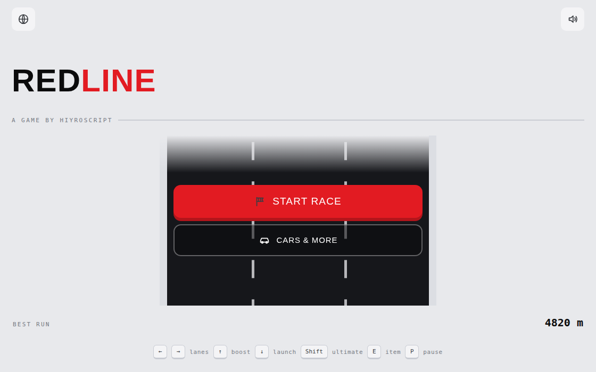
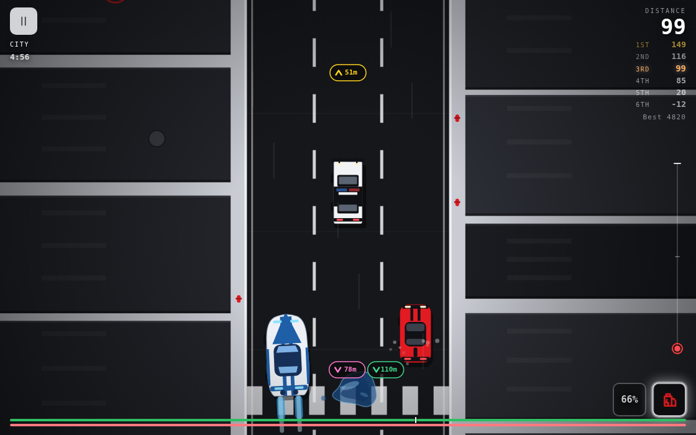
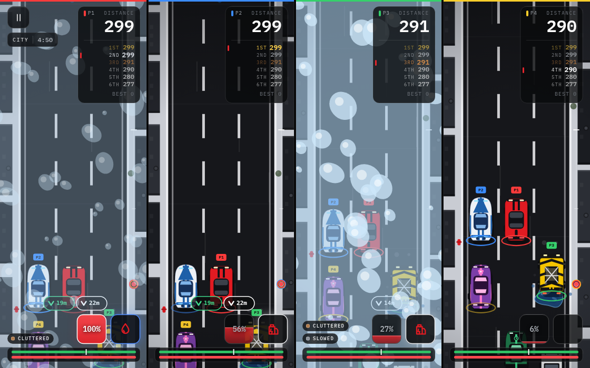
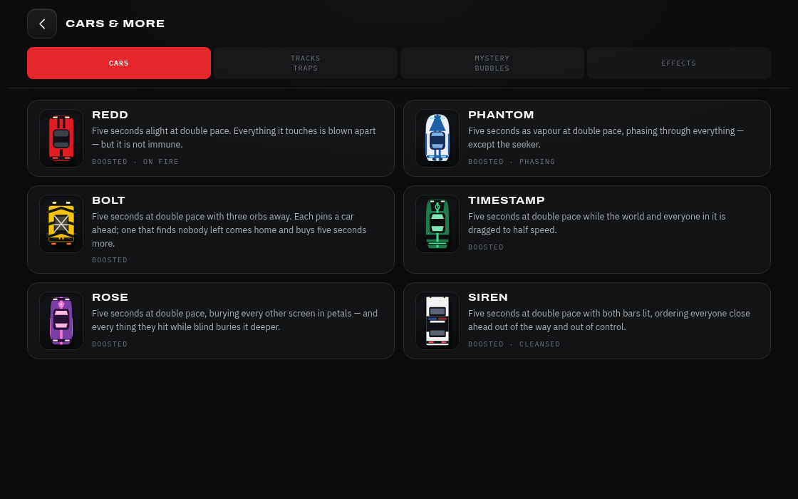

# SEREN

A three-lane arcade racer that runs in a browser tab. Six cars, each with its own
ultimate, race up a road that never stops speeding up — through a city, a desert
and a rainbow strip of deep space — dodging puddles, meteors and tumbleweeds,
grabbing items out of mystery bubbles, and barging each other into the barriers.

No install, no build step, no dependencies. One HTML file, one stylesheet and
fourteen JavaScript files, drawn entirely with hand-written Canvas 2D.

**▶ [Play it](https://hiyroscript.github.io/seren/)** · a game by hiyroscript



---

## Contents

- [Playing](#playing) · [Controls](#controls) · [Modes](#modes)
- [The cars and their ultimates](#the-cars-and-their-ultimates)
- [Driving](#driving) · [The launch](#the-launch) · [Contact rules](#contact-rules)
- [The road](#the-road) · [Hazards](#hazards) · [Mystery bubbles and items](#mystery-bubbles-and-items)
- [Effects](#effects) · [Race structure](#race-structure) · [Difficulty](#difficulty)
- [Local multiplayer](#local-multiplayer) · [Settings and saved data](#settings-and-saved-data)
- [Accessibility](#accessibility) · [Browser support](#browser-support)
- [Running it locally](#running-it-locally) · [Project layout](#project-layout) · [Deploying](#deploying)
- [Known quirks](#known-quirks)

---

## Playing

Open the page, pick a language the first time, then **Start race**. Pick a mode,
pick a car, and the lights go out three seconds later.

**Cars & more** on the home screen is the reference: every car's ultimate, every
track, every trap, the mystery-bubble drop odds, and what each status effect
means. It is the in-game manual and it is built from the same tables the race
reads, so it can never drift out of date.



The HUD, clockwise from the top left: the track name and race clock; the distance
you have covered and the six-car standings, with your row picked out; a ladder
down the right showing how far ahead or behind each racer is; your ultimate meter
and item box bottom right; and the boost bar (green) and launch bar (red) across
the foot. Racers off the top or bottom of the screen get an edge badge with their
lane and the gap in metres — or, past 500m, a pair of chevrons on the ladder.

## Controls

### Keyboard

| Key | Does |
| --- | --- |
| `←` `→` or `A` `D` | change lane (and barge whoever is in it) |
| `↑` or `W` — hold | boost |
| `↓` or `S` — hold, then release | brake, wind up, launch |
| `Shift` or `Space` | ultimate |
| `E` | use the item you are holding |
| `P` or `Esc` | pause / resume |
| `Space` / `Enter` on a menu | take the obvious next step (and pick a random car on the car sheet) |

### Touch and mouse — on the canvas

| Gesture | Does |
| --- | --- |
| swipe left / right | change lane — a held drag keeps stepping across |
| swipe up and hold | boost |
| swipe down and hold, then lift | brake, wind up, launch |
| press and hold one finger (0.35s) | ultimate |
| double-tap (within 0.5s) | use the item |
| tap the ultimate square / item box | ultimate / use item |

A vertical gesture latches until the finger comes off, so a wobble back the other
way cannot flip you from braking into boosting halfway through a launch. The
ultimate needs **one** finger held — a second finger on the glass suppresses it.

### Controller — local play

Browsers report a "standard" mapping for PlayStation, Xbox and most third-party
pads alike, so one table covers all of them.

| Control | Does |
| --- | --- |
| left stick ← / → (or d-pad) | change lane |
| left stick held down (or d-pad down) | brake, then launch on release |
| right stick held up (or d-pad up) | boost |
| both sticks clicked in (L3 + R3 / LS + RS) | ultimate |
| R2, or Circle (Xbox: RT, or B) | use the item |
| Options (Xbox: Menu) | pause |
| Cross / Options on a panel | resume, or race again |
| Circle on a panel | leave the race |

Everything is edge-triggered off a per-player snapshot of the previous frame, so a
held trigger fires once and a held stick walks across the lanes at a readable pace.

## Modes

**Endless** — no finish line. Five bots on the road with you and a road that keeps
getting faster. Drive as far as you can; leaving the race banks the distance as
your personal best.

**Race against bots** — pick a difficulty, then race the full distance: five
minutes, then three track changes, then 900 metres to the flag. Six cars, every
trap, every pickup, and a finishing order at the end.

**Local play** — two to four people on one screen, one controller each, on a
computer. The screen splits into equal columns and the bots fill whatever seats
are left, so it is always a six-car field. Local play is offered on phones but
greyed out with the reason, because it needs a keyboard-and-mouse machine with
pads attached.

Local play then asks how you want to race:

- **Standard play** — the full game, with a difficulty for the bots.
- **Custom play** — set the road up your way: how many bots (from none up to
  however many seats the people leave free), and whether traps, mystery bubbles,
  boost-and-launch, and ultimates are on the table at all.

Backing out of a custom setup and choosing standard restores the defaults, so you
never inherit half a custom race by accident.

## The cars and their ultimates

Every ultimate runs the same **five seconds at double pace**. What differs is what
it does to everybody else. The meter fills on one clock for every car on the road —
yours and theirs — so a difficulty changes how well a bot picks its moment, never
how soon it gets one.

| Car | Ultimate | What it does |
| --- | --- | --- |
| **Redd** | Burn | Five seconds alight. Everything it touches is blown apart — but it is not immune. |
| **Phantom** | Phase | Five seconds as vapour, phasing through everything — except the seeker. |
| **Bolt** | Storm | Three orbs away. Each pins a car ahead for five seconds; one that finds nobody left comes home and buys five seconds more. |
| **Timestamp** | Freeze | The world and everyone in it is dragged to half speed. Timestamp is not. |
| **Rose** | Bloom | Buries every other screen in petals — and every thing they hit while blind buries it deeper. |
| **Siren** | Siren | Both bars lit, ordering everyone close ahead out of the way and out of control. |

### The ultimate meter

- **75 seconds** from empty to ready, for every car in the field.
- Hitting a **trap** costs 5%; being **wrecked** costs 10%; **wrecking somebody
  else** pays 10%.
- While an ultimate is running the meter shows its remaining duration, so those
  penalties and rewards wait until it has finished rather than cutting it short.
- Bolt is the exception that can extend: each orb that comes home adds five
  seconds to the clock, and they stack.

### How ultimates interact

When two cars meet, one function decides the outcome, so barging into a lane and
running into a back bumper always agree. The order is the whole ruleset:

1. **Phasing and immunity are absolute** — they meet nothing at all.
2. **A bumping ultimate clears the road** (Bolt, Timestamp, Rose, Siren). It
   shoulders the other car into the next lane rather than destroying it, and it
   beats a burning one — which is why Redd cannot destroy those three while their
   ultimates are running.
3. **Burning destroys whatever is left** (Redd).

Phantom coming back solid on top of somebody takes both cars out.

## Driving

**Lanes.** Three of them. Changing lane into an occupied one is a barge: if the
other car has room it is shoved across and left labouring; if it is already
against a barrier, the hit wrecks it. Either way the lane is yours.

**Boost.** A full bar lasts about 2.5 seconds at 1.5× pace and takes about 7
seconds to refill. Run it completely dry and it locks out until it is full again.
It will not run while the brake is down, or while you are pinned, ordered or
wrecked.

**Wrecks.** Being destroyed parks you for 3 seconds, then respawns you immune for
2 more. Immunity is total — every effect, hazard, trap and attack — and it phases,
so you pass through anything that would otherwise meet you.

### The launch

The one mechanic worth practising.

1. **Hold the brake.** The car sheds speed over 1.4 seconds until it is stopped
   dead. The red bar is literally the speed left in the car, so "empty" means
   stopped.
2. **Get under the notch.** Once the bar is below 60%, the launch is armed —
   release any time after that and the car goes up.
3. **Or keep holding.** Now you are spending time, not speed, while the whole
   field drives past. 1.6 more seconds fills the same bar back up in white. A
   dead stop is 42% of the way to a full launch; the wind-up is the rest.
4. **Release.** You are in the air for 0.85–3.8 seconds at 1.18×–2.80× road
   speed, up to 2.8 car heights high.

In the air, grounded traps and cars pass harmlessly underneath and you **wreck
whatever you come down on** — but the seeker and Bolt's orbs still reach you up
there. Ten seconds of cooldown before you can launch again, and the red bar
refilling *is* that cooldown.

Braking is roughly free — a light launch comes out a couple of metres down on
driving straight through, so it is an escape. Winding up is anything but: every
second stopped hands thirty-odd metres to five cars that are not stopped, in
traffic where anything can barge, pin or order you and take the whole charge with
it. That curve is the point of the mechanic.

Bots run this exact mechanic — the same meter, the same notch, the same cooldown,
the same landing rule. All the AI supplies is the hold and the release.

### Contact rules

A car is **untouchable** — meets nothing and nothing meets it — when it has
finished, is wrecked, is immune, is phasing, or is in the air. A car is **safe
from being barged or wrecked** when it is untouchable, burning, or running a
bumping ultimate.

## The road

Three tracks, swapping every 60 seconds. Where two meet, the ground interlocks
along a wandering seam rather than butting up against a line, and the driving
surface fades over a stretch rather than at a step.

| Track | Looks like | Hazard |
| --- | --- | --- |
| **City** | Dark asphalt between pale rooftops, water tanks and helipads. White lane dashes, crosswalks and red hydrants along the kerb. | Puddle |
| **Desert** | Sand-coloured ground and layered rock, cacti and scrub on the shoulders. Sand drifts across a dark road under faded yellow markings. | Tumbleweed |
| **Rainbow space** | A road of scrolling rainbow bands over near-black, edged with neon cyan rails. Nothing beside it but a drifting starfield. | Meteor |

The road speeds up **5% every 30 seconds, up to double** — so it tops out ten
minutes in.

### Hazards

| Hazard | Track | What it does | Ultimate cost |
| --- | --- | --- | --- |
| **Puddle** | City | Water over your screen: cluttered for 2.6 seconds | −5% |
| **Meteor** | Space | A blinking red ring marks the impact. Anything in the blast is destroyed and respawns after 3 seconds | −10% |
| **Tumbleweed** | Desert | Rolls across from either side; halves your speed for 1.7 seconds | −5% |

The meteor's ring is a spot on the *road*, not on your screen, and how long the
rock has left is measured in seconds — so it lands where it was always going to
land no matter what you do to your own speed. Only Timestamp's chronokinesis
stretches the fall, because that is the world's clock.

Redd, alight, blows any hazard apart on contact. The seeker clears everything it
passes through. In the air, hazards simply go by underneath.

### Mystery bubbles and items

Three bubbles drift across the road together, a row every 5,400–8,600 road units.
Touch one for a random item and take as many of the three as you can reach — each
new one **replaces** what you hold, and a trade flashes the box so a silent swap
still reads.

| Item | Rarity | Drop | Leading | What it does |
| --- | --- | --- | --- | --- |
| **Boost can** | Common | 66.7% | 70.6% | 2.2 seconds at 1.55× that does not touch your boost meter |
| **Oily oil** | Rare | 27.8% | 29.4% | Drops a slick behind you for 15 seconds. The first racer to touch it loses all grip for 4 seconds — reversed steering — and takes the slick with them |
| **Seeker** | Legendary | 5.6% | — | A missile that hunts the leader, destroying whatever it passes through |

The seeker never drops for whoever is leading; out in front, its share goes to the
other two. Nothing survives a seeker hit — immunity and the flag stop it, but
phasing does not.

A row does not sit there forever. It flashes and goes on whichever comes first:
the last stretch before it drops off the bottom, or a 30-second clock that only
runs when the road has all but stopped.

## Effects

Every state a car can be in, shown as a label beside the HUD. **Cleansed** wipes
and blocks the ones marked *negative*; beneficial ones are never touched, so
cleansing while boosted keeps the boost.

| Effect | | Meaning |
| --- | --- | --- |
| **Slowed** | negative | Anything making you go slower, whatever put it there |
| **Boosted** | | Anything making you go faster, whatever put it there |
| **Cluttered** | negative | Anything fouling your screen. Rose drives it in five stages, and only contact deepens it |
| **Shocked** | negative | Bolt's orb. Pinned for five seconds. An orb arriving at an already-pinned car goes looking for the next one up the road |
| **Chronokinetically affected** | negative | Timestamp has slowed the world. Half pace for five seconds — except Timestamp |
| **Ordered** | negative | Siren has ordered you aside. No controls at all, and you are moved out of Siren's lane whenever Siren takes yours |
| **Slippery** | negative | No grip: left goes right and right goes left |
| **On fire** | | Redd alight. Destroys anything it touches, but is not immune |
| **Phasing** | | Phantom as vapour. Passes through anything — but not the seeker |
| **Powered** | | An orb with nobody left to pin came home to Bolt. Five more seconds, and they stack |
| **Cleansed** | | Clears every negative effect and blocks new ones while it lasts |
| **Launched** | | You are in the air |
| **Immune** | | Total immunity, and you phase through everything |
| **Winner** | | Over the line. Off every target list, invincible, out of the race you finished |

At most six labels are on screen at once; the oldest makes room.

## Race structure

**Endless** has no finish line — it runs until you leave.

**Race against bots** and **local play** run to a flag:

```
0:00 ─────────── 5:00 ──────── track ── track ── track ── +900m ── 🏁
     five minutes           three track changes      the last stretch
```

When the third track change lands, the flag is planted 900 metres ahead. Cars
cross, are given a place, and roll out onto a staircase of marks past the line —
first place furthest, each place behind stopping one step earlier, in alternating
lanes — so the field parks in the order it finished. Finishers are out of play
entirely: nothing can target or touch them.

On one screen the race ends when your car crosses. On four it ends when the last
*person* crosses; bots still on the road finish behind, as they always do.

## Difficulty

A difficulty is **not** a multiplier on anything the car does. Every setting
drives the same car at the same pace off the same charge clock. What changes is
how well the driver *thinks*.

| | Easy | Medium | Hard | Brutal |
| --- | --- | --- | --- | --- |
| Misses trouble in its own lane | 52% | 26% | 10% | 3% |
| Reaction time | 0.70–1.40s | 0.35–0.75s | 0.18–0.42s | 0.07–0.22s |
| Reconsiders the race every | 0.50–0.95s | 0.34–0.68s | 0.22–0.46s | 0.14–0.30s |
| Reads hazards this much further ahead | — | 110 | 250 | 380 |
| Projects other cars forward | — | 0.35s | 0.80s | 1.30s |
| Overall competence | 0.14 | 0.46 | 0.80 | 1.00 |
| Picks targets deliberately | 0.10 | 0.42 | 0.78 | 1.00 |
| Defends its place | 0.06 | 0.36 | 0.72 | 1.00 |
| Values items and ultimates | 0.10 | 0.46 | 0.82 | 1.00 |
| Understands the launch | 0.18 | 0.52 | 0.84 | 1.00 |
| Decision left to chance | 50% | 26% | 11% | 3.5% |

In practice: **Easy** is slow to spot trouble and happy to let you by. **Medium**
races you fairly and takes a lane when it needs one. **Hard** blocks, barges and
times its ultimates well. **Brutal** misses nothing, defends every lane, and
wrecks you if it can.

On top of difficulty, each car has a **temperament** — nerve, spite, patience,
guard and flair — that is jittered at the start of every race, so five bots on one
setting are not the same bot five times, and the Redd you raced last time is not
quite this one.

Bots only ever *decide*. The doing is handed straight back to the same functions
your own inputs call, so a bot barging, launching, dropping oil or spending an
ultimate is running your mechanic, not a copy written for bots.

## Local multiplayer



Two to four people, one controller each, on one computer. The flow is: player
count → controller discovery → standard or custom → difficulty (or the custom
sheet) → each player picks a car in turn with their own pad → race.

- The screen splits into equal columns, one per person. Each column is a full
  game — its own camera, its own instruments — and the world is built wide enough
  to cover the whole spread of the field, so a player half a screen up the road
  is not driving through nothing.
- The field is always **six cars**. Bots fill whatever seats the people leave.
- Every human car wears a coloured ring on the road, and the cars that are not
  yours wear a numbered flag, so two players in identical positions on two
  columns can still be told apart.
- Cars are picked one at a time and a car already spoken for is dead on the board
  for everyone after. Backing out undoes one pick at a time.
- **If a controller drops out mid-race the whole race pauses**, every car lets go
  of everything it was holding, and the panel says whose pad it was. Reconnect it
  and carry on.
- Local play reads the personal best but never writes it — four people on one
  machine do not share a record.

## Settings and saved data

Three values in `localStorage`, and nothing else:

| Key | Holds |
| --- | --- |
| `seren.lang` | `en` or `fr` |
| `seren.sound` | `1` or `0` |
| `seren.best` | your furthest distance, in metres |

If `localStorage` is unavailable — a private window, blocked site data — the game
falls back to an in-memory store and keeps working for the session.

**Language.** English and French, switchable any time from the globe on the home
screen. The first visit asks.

**Sound.** All generated with the Web Audio API — no audio files. The context is
created lazily on your first interaction, so browsers never refuse it for starting
outside a user gesture. The speaker icon toggles it.

## Accessibility

- **Reduced motion.** `prefers-reduced-motion: reduce` flattens the page's
  animations. Things drawn frame-by-frame on the canvas sit outside CSS, so they
  ask for the preference themselves — the item-box swap flash, for instance,
  becomes a brightness pulse with the box held still.
- **Language.** Every string in the interface is translated, including the
  reference pages.
- **Desktop scaling.** On a large screen the whole shell is scaled up to fill the
  window rather than sitting small in the middle, and the canvas backing store is
  resized to match, so it stays crisp.
- **Orientation and resize.** The world scales off the viewport *height* against a
  portrait phone as the reference, which is what keeps both orientations the same
  game: a short landscape viewport draws a smaller road and smaller cars, so the
  stretch of road in front of you, measured in car lengths, comes out identical.

## Browser support

Any current desktop or mobile browser. The game uses Canvas 2D, Pointer Events,
Web Audio, the Gamepad API, `matchMedia` and `localStorage`, and degrades
gracefully where newer canvas features are missing — `roundRect`, `ellipse`,
`Path2D` and canvas `letterSpacing` all have hand-written fallbacks.

Local play needs a device that reports `(hover: hover) and (pointer: fine)` — a
computer — plus a controller per player.

## Running it locally

There is nothing to install and nothing to build. Any static file server will do:

```sh
git clone https://github.com/hiyroscript/seren.git
cd seren
python3 -m http.server 8000
# then open http://localhost:8000
```

Opening `index.html` straight off the filesystem mostly works, but a server is
better — some browsers restrict `localStorage` and canvas reads on `file://`.

To edit: change a file, reload the page. That is the whole loop.

### Checking your changes

Because there is no build step, nothing normally catches a typo'd selector, a
translation key that does not exist, or a second `const` with a name another file
already used — the first two do nothing visible until you open the screen that
uses them, and the third kills the page on load. One script finds all of it:

```sh
node tools/check.mjs
```

It is plain Node with no dependencies — there is no `package.json` and nothing to
install — and it exits non-zero on failure, so it drops into a git hook or a CI
job unchanged. It verifies:

- every stylesheet and script in `index.html` exists, is deferred, and is in the
  documented dependency order, with no inline `<style>` or `<script>` left behind
- every JavaScript file parses
- every top-level name is unique across all fourteen files, and none shadows a
  browser global
- every literal `#id` selector in the JavaScript resolves to an element that
  exists in `index.html`
- every string has all its languages, and every `data-i18n` attribute and literal
  `t("…")` call resolves to a string that exists
- every car has a draw branch, a name, an ultimate description, a button, a
  select-screen canvas and an `ULT_EFFECTS` entry; every effect has a label;
  every item has artwork and a valid rarity

Run it before you commit. It takes well under a second.

## Project layout

```
index.html          the document shell — screens, canvases, SVG icons, script tags
css/app.css         the entire stylesheet
js/                 the game, in load order (see below)
tools/check.mjs     dependency-free validator for the invariants below
docs/               ARCHITECTURE.md, TUNING.md and the screenshots
upd                 the brief that drove the split into these files
.nojekyll           tells GitHub Pages to serve the tree verbatim
```

The fourteen scripts load in a fixed, dependency-safe order with `defer`, so each
may rely on the ones above it and nothing starts before every declaration exists.

| File | Owns |
| --- | --- |
| `core.js` | storage with a memory fallback, the small maths/DOM helpers, capability flags |
| `i18n.js` | every string, the current language, and the sweep that writes them into the page |
| `data.js` | cars, difficulties, temperaments, effects, items, tracks and every tuning constant |
| `audio.js` | the lazily-created Web Audio context, tones, noise, engine |
| `runtime.js` | canvas and context, road and split-view geometry, the game state object, layout/resize |
| `ui.js` | screen switching, garage, custom setup, the car board, select-screen art |
| `local.js` | seats, player colours, pad discovery, the menu pad loops |
| `ai.js` | the bot mind: sense, weigh, act |
| `mechanics.js` | contact, lanes, boost, the launch, wrecks, effects, ultimates, items, hazards, particles |
| `race.js` | world seeding, the grid, the lifecycle, the finish, the per-frame update and frame loop |
| `render.js` | all Canvas 2D drawing |
| `hud.js` | the DOM HUD, the effect labels, the per-seat canvas HUD |
| `input.js` | keyboard, pointer and controller, translated into mechanics calls |
| `main.js` | boot: initial paints, event wiring, splash, settle |

**[docs/ARCHITECTURE.md](docs/ARCHITECTURE.md)** goes through how it fits together
and where to change what. **[docs/TUNING.md](docs/TUNING.md)** is every dial in one
place.



## Deploying

It is a plain static site with relative asset paths, so it works under any base
path. This repository is served by GitHub Pages from `main` — push, and the
`pages-build-deployment` workflow republishes it. Any static host works the same
way: copy `index.html`, `css/` and `js/` and you are done.

## Known quirks

- **There is no traffic.** `TRAFFIC_ENABLED` in `js/core.js` is `false`, which
  switches off the civilian cars. Endless mode's description still mentions dense
  traffic, and the "You clipped traffic" race-over panel is the wreck path that
  traffic used to trigger — with traffic off, endless has five bots instead and
  runs until you leave. Flipping the flag back to `true` brings the traffic
  system back; nothing else needs to change.
- **The internals are reachable from the console.** The game runs as ordered
  classic scripts rather than inside a closure, so `G`, `CARS`, `startUlt` and the
  rest are global. Handy for debugging, and it means a determined player can poke
  the state. The only persisted value, the personal best, was always one
  `localStorage.setItem` away regardless.

## Credit

A game by **hiyroscript**. No license file is present, so default copyright
applies until the author adds one.
